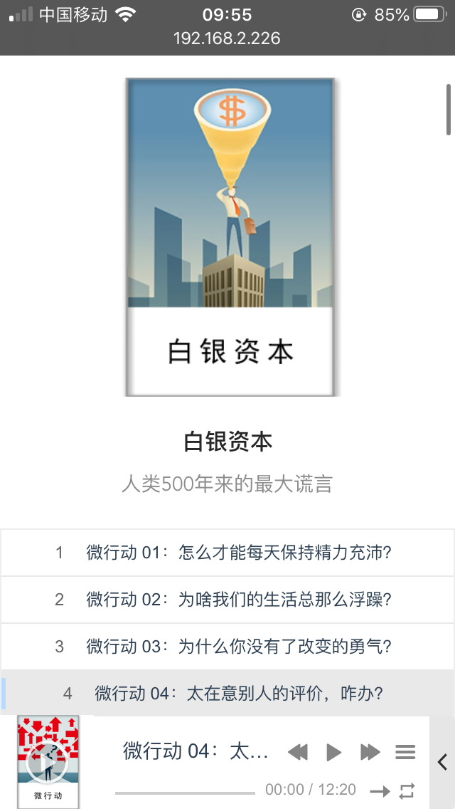

# name
老马商书资源整合站

# description
frontend使用了ant-design的样式，通过vue数据绑定，vuex状态管理，使用indexeddb缓存到本地，vue-aplayer插件加载播放器。

backend通过app提供RESTful风格API、spider提供数据抓取，通过redis的rdb持久化到本地。

业务主要文件介绍
 ```c
├── backend     
│   ├── Dockerfile      #构建打包golang项目
│   ├── redis           #redis本地持久化和配置
│   ├── app             #业务主要代码
│   ├── spider          #数据抓取脚本
└── frontend           
    ├── Dockerfile      #多阶段构建打包vue和nginx
    └── web-book        
        ├── package.json    #vue项目依赖
        ├── src             #业务主要代码
 ```

所有资料均来自于互联网，仅供学习交流使用，侵删。

# using
1. 初始化环境，打包编译前后端代码。
```c
docker-compose up --build

```

```c
lmbook_web git:(master) ✗ docker-compose ps

  Name                Command               State                      Ports                    
------------------------------------------------------------------------------------------------
backend    ./main                           Up                                                  
frontend   nginx -g daemon off;             Up      0.0.0.0:8080->80/tcp, 0.0.0.0:8081->8081/tcp
redis      docker-entrypoint.sh redis ...   Up      6379/tcp     
```

2. 确保redis正常，运行数据抓取脚本。
```c
docker exec backend sh -c "go run cli/catch.go"
```


3. 访问web http://localhost:8080 即可。
